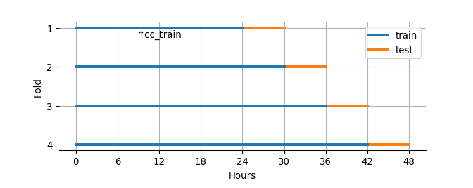
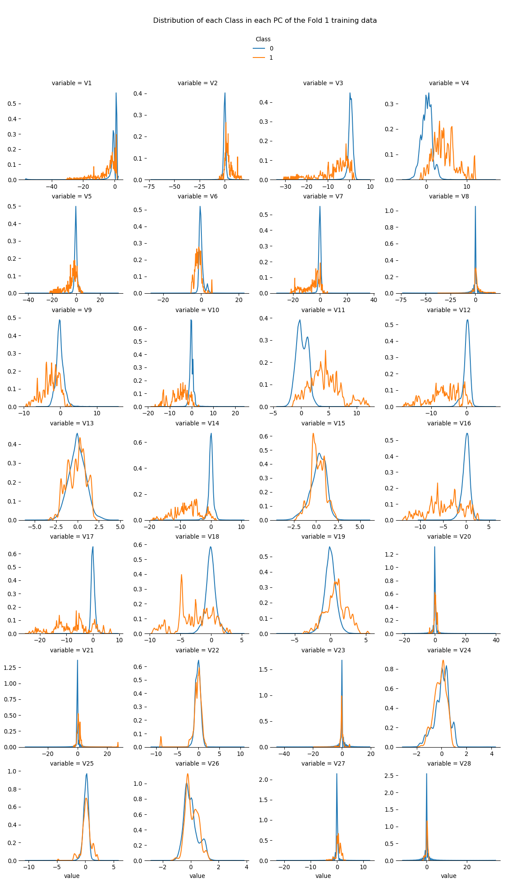
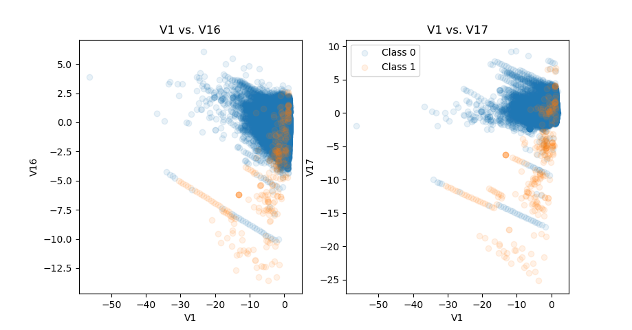
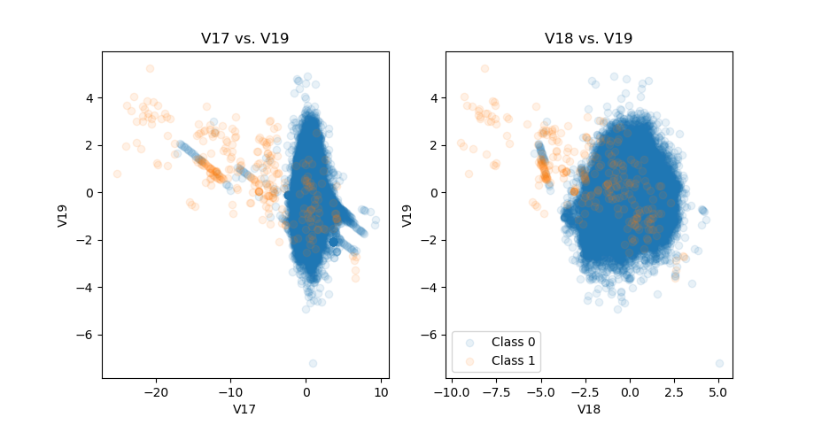
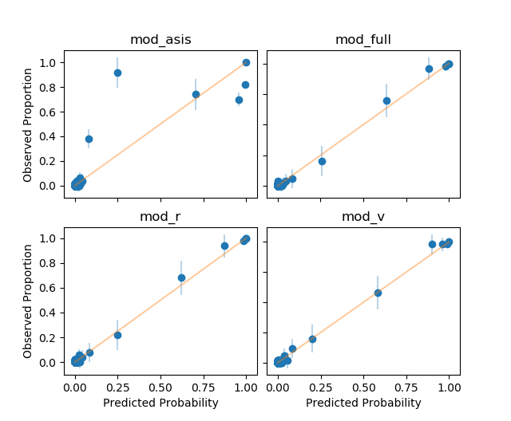

```{r setup, echo = F, results = 'hide', warning = F, message = F}
library(dplyr)
library(reticulate)
knitr::knit_engines$set(python = eng_python)
use_virtualenv('r-reticulate')
py_available(T)
```

Three Python scripts are required to reproduce the analysis:

* the [script](https://github.com/joon3216/joon3216.github.io/blob/master/files/creditcardfraud/creditcardfraud.py) that loads dataset, and produces figures and tables
* the [script](https://github.com/joon3216/joon3216.github.io/blob/master/files/creditcardfraud/creditcardfraud_functions.py) where functions used in the analysis are stored
* the [script](https://github.com/joon3216/joon3216.github.io/blob/master/files/creditcardfraud/creditcardfraud_models.py) that produces models and classification results


```{python packages, echo = F, results = 'hide'}
from matplotlib.offsetbox import HPacker
from patsy import dmatrices, dmatrix
from scipy.optimize import curve_fit
from sklearn.metrics import roc_curve
from statsmodels.stats.outliers_influence import variance_inflation_factor
import matplotlib.pyplot as plt
import numpy as np
import pandas as pd
import seaborn as sns
import statsmodels.api as sm

# Functions
exec(
    open('../../../files/creditcardfraud/creditcardfraud_functions.py')\
    .read()
)

# Reordering columns
creditcard = pd.read_csv('../../../files/creditcardfraud/creditcard.csv')
Vs = list(map(lambda i: 'V' + str(i), range(1, 29)))
cols =  ['Class', 'Time', 'Amount']
cols.extend(Vs)
creditcard = creditcard.loc[:, cols]
```


<!--html_preserve-->
<div id="TOC" class="toc" style="padding:2rem 2rem 0 0;">
<ul style="list-style:none;">
<li><a href="#summary">1. Summary</a></li>
<li><a href="#analysis">2. Analysis</a><ul>
<li><a href="#features">2.1. Features</a></li>
<li><a href="#models">2.2. Models</a></li>
<li><a href="#performance">2.3. Performance</a></li>
</ul></li>
<li><a href="#conclusions">3. Conclusions</a></li>
<li><a href="#concerns">4. Concerns</a></li>
<li><a href="#session-info">Session info</a></li>
</ul>
</div>
&nbsp;
<!--/html_preserve-->


# 1. Summary

Logistic regression is initially used to classify fraudulent transactions in [`creditcard` dataset](https://www.kaggle.com/mlg-ulb/creditcardfraud/) and to define binary classifiers. Also, to increase the overall accuracy of classification by diversifying thresholds, the "compounded model" is designed and then compared to the vanilla logistic regression. The compounded model first uses multinomial logistic regression to predict the outcome of binary classification into `TPN` (true positive or negative), `FP` (false positive), and `FN` (false negative), and then applies different probability thresholds for each expected outcome to classify an observation as fraudulent or non-fraudulent. Regardless of the choice of binary classifier, the compounded model achieves a higher accuracy in both training and test sets due to an improved performance in detecting non-fraudulent transactions. However, the true positive rate is lowered mainly due to a rarity of fraudulent cases in the original dataset.


# 2. Analysis

Pre-existing features of the dataset are explored to conduct feature selection and, if applicable, transformations. After exploration, a few plausible logistic regression models and then corresponding "compounded" models, i.e. models that perform ternary classification for each observation and then apply different probability thresholds for binary classification, are fitted.


## 2.1. Features

The data consists of the response `Class`, 2 features `Time` and `Amount`, and 28 principal components. No missing data is present.

* `Class` is the response: 1 in case of fraud and 0 otherwise.
* `Time` contains the seconds elapsed between each transaction and the first transaction in the dataset. The maximum `Time` of `creditcard` data is 172792 seconds, indicating that the data amounts to 48 hours minus 8 seconds worth.
* `Amount` is the transaction amount.
* Columns that start with `V` are principal components.


### 2.1.1. `Time`

Due to the ordered structure of `creditcard` by `Time`, the following 4 train-test combinations are used for model fitting and evaluation:

1. the first 24 hours and the following 6 hours of data as training and test sets respectively
2. the first 30 hours and the following 6 hours
3. the first 36 hours and the following 6 hours
4. the first 42 hours and the following 6 hours

`cc_train`, the first 24 hours worth of data (i.e. the training data in the first fold), is selected as a representative of training datasets.

```{python eg2_1_1_1, echo = F}
n_splits = 4
splits = list(range(
    86400, # minimum size of the training set
    172800 + int((24 / n_splits) * 3600), 
    int((24 / n_splits) * 3600)
))
splits = [splits[i:(i + 2)] for i in range(len(splits) - 1)]
cc_trains = {}
cc_tests = {}
for i, row in enumerate(splits):
    cc_trains[i + 1] = creditcard.query('Time <= {0}'.format(row[0]))
    cc_tests[i + 1] =\
        creditcard.query('{0} < Time <= {1}'.format(row[0], row[1]))
cc_train = cc_trains[1]
```

```{r eg2_1_1_2_r, fig.align = 'center', echo = F}

```


Not every observation in `cc_train` has the unique `Time` value, indicating that some `Time` occurs more often than the other. The number of occurrence of each `Time` in `cc_train` is precisely the number of transactions at that `Time`. [Fast Fourier transform](https://en.wikipedia.org/wiki/Fast_Fourier_transform) is used to fit a sine function (call it `fitted_func`) that estimates the `Occurrence` of `Time` and to check the `Time` trend:


```{python number_of_transactions, echo = F, fig.asp = .6, fig.align = 'center', results = 'hide'}
splits_lst = range(
    0, 
    172800 + int((24 / n_splits) * 3600), 
    int((24 / n_splits) * 3600)
)
cc_train_all_Times = get_occurrence(cc_train)
cc_train_fitted_sin = fft_curve(
    cc_train_all_Times['Time'], 
    cc_train_all_Times['Occurrence'], 
    True
)
fitted_func = lambda t: cc_train_fitted_sin['fitfunc'](t)
plt.clf()
plt.plot(
    cc_train_all_Times['Time'], cc_train_all_Times['Occurrence'], 
    alpha = .5,
    label = 'Actual occurrence'
)
plt.plot(
    cc_train_all_Times['Time'], fitted_func(cc_train_all_Times['Time']),
    label = 'Estimated occurrence based on cc_train'
)
plt.legend(loc = 'upper left')
plt.xlabel('Time (in sec)')
plt.xticks(splits_lst[:(splits_lst.index(86400) + 1)])
plt.ylabel('Occurrence')
plt.title('Number of transactions as Time progresses', loc = 'left')
plt.show()
```

The occurrence estimate gets better as the size of training set increases. `Time` occurrence of the entire `creditcard` dataset is plotted along with fitted curves of each fold. Bumps and valleys of the `Time` occurrence match for fold 3 and 4 throughout `Time`, but not so much for fold 1 (`cc_train`) and fold 2 after about 100,800. Also, the lines of fold 3 and fold 4 are almost identical, indicating that the size of training set is irrelevant after the size gets sufficiently large when it comes to estimating periodicity.

```{r comp_occu_est, echo = F, fig.align = 'center'}
knitr::include_graphics('../../../files/creditcardfraud/comparison_occu_est.png')
```


Distributions of the `Occurrence` estimates based on `cc_train` are visualized for each `Class` to see whether they draw different density estimations. KDE plots with bandwidth 0.075 show that there are three dominant peaks in each cycle of fraudulent transactions (i.e. `Class` 1): near minimum, near 1.9, and near maximum. Non-fraudulent transactions (`Class` 0) have a high peak near maximum and a lower peak near minimum.

```{python red_line_dist, echo = F, fig.align = 'center', fig.asp = .6, results = 'hide'}
all_Times2 =\
    Pipe(cc_train)\
    .pipe(get_occurrence)\
    .pipe(
        pd.merge,
        cc_train[['Time', 'Class']],
        'left',
        'Time'
    )\
    .pipe(pd.DataFrame.dropna)\
    .collect()
plt.clf()
for j in range(2):    
    sns.kdeplot(
        fitted_func(all_Times2.query('Class == ' + str(j))['Time']), 
        bw = .075, 
        label = 'Class ' + str(j)
    )
plt.title(
    'Distributions of the ocurrence estimates', 
    loc = 'left'
)
plt.legend(loc = 'upper left')
plt.show()
```

The reason for not using `Occurrence` as-is is because the purpose of the model is to classify inputs of any number of observations. For example, if a single observation is given to a model, then it won't be able to compute the appropriate `Occurrence` from a given `Time` since `Occurrence` is the count of repeating `Time`s in a data.

```{python fraudulent_transactions_at_a_time, echo = F, fig.align = 'center', results = 'hide', fig.asp = .6}
cc_train_Class1_Time_counts = cc_train\
    .loc[:, ['Class', 'Time']]\
    .query('Class == 1')\
    .groupby('Time')\
    .agg(counts = ('Class', 'sum'))\
    ['counts']\
    .value_counts()
plt.clf()
plt.bar(
    [str(i) for i in cc_train_Class1_Time_counts.index], 
    cc_train_Class1_Time_counts
)
for i in cc_train_Class1_Time_counts.index:
    plt.annotate(
        str(cc_train_Class1_Time_counts.loc[i]), 
        xy = (
            str(i), 
            cc_train_Class1_Time_counts.loc[i]
        ), 
        ha = 'center',
        va = 'bottom'
    )
plt.title(
    'Number of fraudulent transactions at a given point in Time',
    loc = 'left'
)
plt.xlabel('Number of fraudulent transactions at a Time')
plt.ylabel('Number of moments')
plt.show()
```

```{python fraudulent_transactions_at_a_time2, echo = F}
df = pd.DataFrame(cc_train_Class1_Time_counts).reset_index()
```

```{r fraudulent_transactions_at_a_time2_r, echo = F}
df <- py$df
maj <- (df$index * df$counts)[1] / sum(df$index * df$counts)
```

The vast majority (`r round(maj * 100, 3)`%) of fraudulent transactions in `cc_train` occur one at a time. 4 fraudulent transactions occur all at once at two different moments in `Time`; at one `Time` alone, there are 6 fraudulent transactions. 

If a large proportion of fraudulent transactions have occurred multiple times at many fixed points in `Time`, then `Occurrence` and its estimate may have had given "more weights" in the model fitting process as detecting at least one `Time` point of fraud will lead to more cases of fraud. Unfortunately, that doesn't seem like the case.


### 2.1.2. `Amount`

`Amount` is heavily right-skewed regardless of the `Class`. Also, minimums of both `Class`es are `0.0`, indicating there are transactions with no money transfer and yet recorded as transactions anyway. The minimum of 0 also means that there are no observations having negative amounts, i.e. observations that would have meant cases like cancellation or refund:

```{python eg2_1_2_1, echo = F}
cc_train_Class_Amount = cc_train[['Class', 'Amount']]
cc_train_Class_Amount_describe = cc_train_Class_Amount\
    .groupby('Class')\
    .describe()
cc_train_Class_Amount_describe
```

The [description of `creditcard`](https://www.kaggle.com/mlg-ulb/creditcardfraud/) does not say whether the `Amount` is 0 because of:

* the prices actually being 0
* the request made by a credit card user (such as a fraud report or cancellation)
* the financial institution blocking the transaction (i.e. the actual `Amount` is not 0, but is set to 0 by the decision of the institution)
* the mixture of all of the above

If the `Amount` is 0 NOT because of the first case, it doesn't quite make sense to use `Amount` in the model fitting process. This is because in either of these cases, the original `Amount` would not have been 0. The cardholder would have noticed the nonzero-`Amount` transaction he or she didn't make; the institution would probably have made the decision with the nonzero `Amount` along with other values of features. Also, the model is about detecting the fraud BEFORE it gets reported from a cardholder, not after.

In this analysis, however, the entire observations are utilized including those with `Amount` 0 because the [description](https://www.kaggle.com/mlg-ulb/creditcardfraud/) states that the "transaction `Amount` ... can be used for example-dependant cost-sensitive learning", implying this is a legitimate feature for a modeling.

```{python eg2_1_2_2, echo = F}
cc_train_Class_Amount0_size = cc_train_Class_Amount\
    .query('Amount == 0')\
    .groupby('Class')\
    .size()
cc_train_Class_Amount0_size
```

```{python eg2_1_2_2_more, echo = F}
cc_train_Class_Amount0_size0 = cc_train_Class_Amount0_size[0]
cc_train_Class_Amount_size0 = cc_train_Class_Amount_describe.iloc[0, 0]
cc_train_Class_Amount0_size1 = cc_train_Class_Amount0_size[1]
cc_train_Class_Amount_size1 = cc_train_Class_Amount_describe.iloc[1, 0]
prop_amt0_class0 = cc_train_Class_Amount0_size0 /\
    cc_train_Class_Amount_size0
prop_amt0_class1 = cc_train_Class_Amount0_size1 /\
    cc_train_Class_Amount_size1
```

```{r eg2_1_2_2_more_r, echo = F}
cc_train_Class_Amount0_size0 <- py$cc_train_Class_Amount0_size0
cc_train_Class_Amount0_size1 <- py$cc_train_Class_Amount0_size1
cc_train_Class_Amount_size0 <- py$cc_train_Class_Amount_size0
cc_train_Class_Amount_size1 <- py$cc_train_Class_Amount_size1
prop_amt0_class0 <- py$prop_amt0_class0
prop_amt0_class1 <- py$prop_amt0_class1
```

A proportion of transactions with no money transfer in each `Class` is checked. Out of `r as.character(cc_train_Class_Amount_size0)` non-fraudulent transactions, there are `r cc_train_Class_Amount0_size0` transactions with the involved `Amount` 0 (which accounts `r round(prop_amt0_class0 * 100, 3)`% of the entire non-fraudulent transactions), and `r cc_train_Class_Amount0_size1` transactions out of all `r cc_train_Class_Amount_size1` fraudulent cases (`r round(prop_amt0_class1 * 100, 3)`%). That is:

* the probability of a transaction having `Amount` 0 is `r round((cc_train_Class_Amount0_size0 + cc_train_Class_Amount0_size1) / (cc_train_Class_Amount_size0 + cc_train_Class_Amount_size1) * 100, 3)`%.
* the probability of a transaction being fraud given the `Amount` is 0 is `r round(cc_train_Class_Amount0_size1 / (cc_train_Class_Amount0_size0 + cc_train_Class_Amount0_size1) * 100, 3)`%.

Distributions of log-transformed `Amount` in each `Class` are also checked. Log-transformation is applied due to a heavy right-skewness; 1 is added to `Amount` and then transformed in order to ensure observations with `Amount` 0 to be evaluated as 0 and not `-inf`.

```{python eg2_1_2_3, fig.align = 'center', fig.asp = .6, echo = F, results = 'hide'}
cc_train_Class_Amount['logAmt_plus1'] =\
    np.log(cc_train_Class_Amount['Amount'] + 1)
plt.clf()
for i in range(2):
    sns.kdeplot(
        cc_train_Class_Amount\
            .loc[lambda x: x['Class'] == i]\
            ['logAmt_plus1'],
        label = 'Class ' + str(i),
        bw = .1
    )
plt.title(
    'Distribution of log(Amount + 1) in each Class', 
    loc = 'left'
)
plt.show()
```


```{python eg2_1_2_4, echo = F}
modes = np.zeros(3)
for i in range(2):
    modes[i + 1] += hsm(
        cc_train_Class_Amount\
            .query('Class == 1 & logAmt_plus1 > ' + str(i))\
            ['logAmt_plus1']
    )
```

```{r eg2_1_2_4_r, echo = F}
modes <- py$modes
```

Three peaks are present in case of fraudulent cases. One of them is at 0, in which we know that the estimated probability of a transaction being fraud given the `Amount` is 0 is `r round(cc_train_Class_Amount0_size1 / (cc_train_Class_Amount0_size0 + cc_train_Class_Amount0_size1) * 100, 3)`%. The other two draws a higher peak, indicating there are more fraudulent transactions at those `Amount`s than at the `Amount` 0. Estimating those two remaining modes using the [HSM method](https://www.ncbi.nlm.nih.gov/pmc/articles/PMC183840/) yields values `r modes[2]` and `r modes[3]`. In actual dollar `Amount`, these are 1 and 99.99 respectively.

```{python eg2_1_2_5, echo = F, results = 'hide'}
lsts = [[1], [99.99], [0, 1, 99.99]]
props = []
for lst in lsts:
    cc_train_Class_Amount0199_sizes = cc_train_Class_Amount\
        .loc[lambda x: x['Amount'].isin(lst)]\
        .groupby('Class')\
        .describe()\
        .iloc[:, 0]
    props.append(
        round(
            cc_train_Class_Amount0199_sizes[1] /\
                np.sum(cc_train_Class_Amount0199_sizes) * 100, 
            3
        )
    )
```

```{r eg2_1_2_5_r, echo = F}
props <- py$props
```

From these modes, the probability of a transaction being fraud given that:

* the `Amount` is 1 is computed as `r props[1]`%
* the `Amount` is 99.99 is computed as `r props[2]`%
* the `Amount` is either 0, 1, or 99.99 is computed as `r props[3]`%

```{python eg2_1_2_7, echo = F}
cc_train_Class_Amount0199_counts =\
    Pipe(
        cc_train_Class_Amount\
            .query('Amount in [0, 1, 99.99] & Class == 1')\
            .groupby('Amount')\
            .agg(counts = ('Class', 'sum'))\
            .assign(total = cc_train_Class_Amount_size1)
    )\
    .pipe(
        mutate, 
        'perc', 
        lambd_df = lambda df: df['counts'] / df['total']
    )\
    .collect()
```

```{r eg2_1_2_7_r, echo = F}
cc_train_Class_Amount0199_counts <- py$cc_train_Class_Amount0199_counts
```

Also, out of all fraudulent transactions in `cc_train`, the probability of:

* the involved `Amount` is 0 is `r round(cc_train_Class_Amount0199_counts$perc[1] * 100, 3)`%.
* the involved `Amount` is 1 is `r round(cc_train_Class_Amount0199_counts$perc[2] * 100, 3)`%.
* the involved `Amount` is 99.99 is `r round(cc_train_Class_Amount0199_counts$perc[3] * 100, 3)`%.
* the involved `Amount` is either 0, 1, or 99.99 is `r round(sum(cc_train_Class_Amount0199_counts$perc) * 100, 3)`%

In other words, `r round(sum(cc_train_Class_Amount0199_counts$perc) * 100, 3)`% of all fraudulent transactions in `cc_train` involve the `Amount` of either 0, 1, or 99.99.

```{python eg2_1_2_8, echo = F}
Pipe(
    add_intercept(cc_train_Class_Amount, 'one', loc = -1)\
        .loc[lambda x: x['Amount'].isin([0, 1, 99.99])]\
        .groupby(['Class', 'Amount'])\
        .agg(counts = ('one', 'sum'))\
        .reset_index()
)\
.pipe(dcast, 'Class ~ Amount')
```

The above table shows counts of each cell `(Class, Amount)`.


### 2.1.3. PCs

Assuming all principal components of selected features are present in the original `creditcard` dataset (i.e. the 28^th^ PC is indeed the last PC), the first PC explains around 12.484% of the total variance in features. This means no PCs in `creditcard` is dominant when it comes to explaining variances of transformed features.

```{python eg2_1_3_1, echo = F, fig.align = 'center', fig.asp = .6, results = 'hide'}
varexp = creditcard.loc[:, Vs].cov().values.diagonal()
perc_varexp = varexp / np.sum(varexp) * 100
cumsum_varexp = np.cumsum(perc_varexp)
PCs = np.arange(1, 29)
plt.clf()
plt.xlim(0, 29)
plt.plot(PCs, cumsum_varexp, label = 'Cumulative proportion')
plt.plot(PCs, perc_varexp, label = 'Proportion of each PC')
plt.title('Variance in features explained by each PC', loc = 'left')
plt.xlabel('Order of PC')
plt.ylabel('Proportion')
plt.xticks(PCs, rotation = 45)
plt.yticks(
    np.arange(110, step = 10), 
    tuple(map(lambda x: str(x) + '%', np.arange(110, step = 10)))
)
plt.grid()
plt.legend()
plt.subplots_adjust(bottom = .15)
plt.show()
```


Distributions of numeric values for each `Class` in each PC of `cc_train` are checked. It is observed that some PCs have a somewhat clearer distinction between `Class`es than other PCs; explaining more variance in the data (i.e. PCs with low numberings like 1 or 2) doesn't necessarily give a clear separation of `Class`.

```{r eg2_1_3_2_r, echo = F, fig.align = 'center'}

```


### 2.1.4. Relationships among PCs

Scatterplots of PC pairs in `cc_train` are investigated. Every PC except `V13` and `V15` is considered because not only a separation of two `Class`es within each PC is vague, but also any pairwise interaction with these two PCs yields an almost entirely encompassed cluster of `Class` 1s within the cluster of `Class` 0s. The chosen 26 PCs, from `V1` to `V28` except `V13` and `V15`, then explains 94.051% of the total variance in features. Interactions of order higher than two (e.g. three-way interactions) are not considered due to a combinatorial explosion. It makes sense to consider pairwise interactions of PCs since many pairs of them have a non-linear relationship.

Some observations regarding relationships between any two PCs in `cc_train` emerge:

1. Some pairs of PCs give either a pattern or distinctive clustering of those observations with the `Class` 1 label.
2. There exist pairs of PCs that have a similar relationship drawn by other pairs.

```{python eg2_1_4_2_py, echo = F, fig.align = 'center', fig.asp = .6}
V_select_vs_others('V1', 'V2')
sns.kdeplot(
    cc_train.query('Class == 1')['V1'], 
    cc_train.query('Class == 1')['V2']
)
plt.show()
```

For example, observations of `Class` 1 in the scatterplot of `V1` vs. `V2` draw an almost-linear relationship. Most of these `Class` 1 observations have non-negative `V2` values, and they are plotted as if they lie on the straight line. This linear pattern is also visible in some of the other plots as well, such as `V1` vs. `V5`.


```{python eg2_1_4_3_py, echo = F, fig.align = 'center', fig.asp = .6}
V_select_vs_others('V4', 'V16')
sns.kdeplot(
    cc_train.query('Class == 1')['V4'], 
    cc_train.query('Class == 1')['V16']
)
plt.show()
```

Occasionally, some pairs of PCs draw a relatively distinctive cluster of `Class` 1s. In the plot of `V4` vs. `V16`, most of the observations with the `Class` 0 label are centered around the origin. Although some `Class` 1 observations are also around the origin, many of them are near $(3, -4)$, $(5, -6)$, or $(8, -11)$.

```{r eg2_1_4_4, echo = F, fig.align = 'center'}

```


The scatterplots of `V1` vs. `V16` and `V1` vs. `V17` illustrate the second finding. Both scatterplots look very similar in terms of patterns. This suggests that if an interaction of one pair is considered, then the interaction of the other pair may be discarded.

```{r eg2_1_4_5, echo = F, fig.align = 'center'}

```


Also, among pairs that have similar patterns, there are cases where one pair has a clearer distinction among `Class`es than the other pair. In case of `V17` vs. `V19` and `V18` vs. `V19`, the former gives a better separation between two classes since many `Class` 1 observations of `V17` are scattered more widely than in `V18`.


### 2.1.5. Which features should be included?

Due to the additive nature of logistic regression, some features and pairs of two different features are weighted by KDE functions fitted with `Class` 1 observations of the training set and then used for modeling. That is, uni-/multivariate KDE functions are fitted based on `Class` 1 observations of applicable features, and each observation is evaluated at the corresponding KDE function. Some logistic regression models are based on these weighted features.

A pairwise interaction of PCs is included under the following rules:

1. Have a clear separation of two `Class`es, or a distinctive clustering of fraudulent transactions.
2. Have a simple clustering that looks generalizable, i.e. the true distribution of `Class` 1 observations is expected to be similar to what one sees in `cc_train`.
3. Do not encompass, or give weights to, too many non-fraudulent transactions in order to reduce the number of false positives.
4. Be different from other pairwise interactions.
5. Be better than other similar pairwise interactions in terms of `Class` separation.

After inspecting features and interactions of PCs in `cc_train`, the decision is made to include the following features to the "full" model:

* `(Intercept)`: the intercept term (column of 1s)
* `kde_occu_est`: (with bandwidth 0.075) KDE-weighted `Occurrence` estimates of `Time`
* `kde_logAmt_p1`: (with bandwidth 0.1) KDE-weighted log-transformed right-shifted `Amount`, or `log(Amount + 1)`
* 26 PCs: from `V1` to `V28` except `V13` and `V15`
* KDE-weighted pairwise interactions:
    + `kde_V1_V2`, `kde_V1_V4`, `kde_V1_V5`, `kde_V1_V10`, `kde_V1_V17`, `kde_V1_V20`
    + `kde_V2_V3`, `kde_V2_V7`, `kde_V2_V10`, `kde_V2_V17`, `kde_V2_V20`
    + `kde_V3_V10`, `kde_V3_V20`
    + `kde_V4_V10`, `kde_V4_V17`, `kde_V4_V20`, `kde_V4_V24`
    + `kde_V5_V6`, `kde_V5_V10`, `kde_V5_V20`, `kde_V5_V23`
    + `kde_V6_V10`
    + `kde_V7_V10`, `kde_V7_V14`, `kde_V7_V20`, `kde_V7_V21`
    + `kde_V8_V10`
    + `kde_V9_V10`, `kde_V9_V14`, `kde_V9_V20`, `kde_V9_V25`
    + `kde_V10_V11`, `kde_V10_V20`, `kde_V10_V28`
    + `kde_V11_V12`, `kde_V11_V26`
    + `kde_V12_V14`, `kde_V12_V20`
    + `kde_V14_V19`, `kde_V14_V20`
    + `kde_V16_V17`
    + `kde_V17_V19`, `kde_V17_V20`


These features are also used for modeling which involves training sets of other folds.


## 2.2. Models

Various binary classifiers are obtained based on training sets in `cc_trains`, logistic regressions, and selected measures. Then, based on each binary classifier, the corresponding compounded model is obtained as well. The quality of these models, including vanilla binary classifiers, is assessed based on false positive rates, true positive rates, and overall accuracies in training and test sets.


### 2.2.1. Logistic regressions and binary classifiers

Four models are considered: `mod_asis`, `mod_full`, `mod_v`, and `mod_r`. All models are equipped with `(Intercept)`:

* `mod_asis` is a simple model that includes all the initial features of the training set except `Time`, and no interactions.
* `mod_full` includes selected features in [section 2.1.5](#which-features-should-be-included). `mod_full` and `mod_asis` are not [nested](https://en.wikipedia.org/wiki/Statistical_model#Nested_models) as `mod_asis` includes `V13` and `V15` but `mod_full` doesn't.
* `mod_v` contains features selected by the stepwise VIF calculation from `mod_full`.
* `mod_r` contains features selected by the stepwise LRTs from `mod_full`.

For each model, the probability threshold ($p_{\text{thres}}$) for binary classification is computed as: $$p_{\text{thres}} = \underset{p}{\text{argmin}}\big\{||\text{ROC}(p) - (0, 1)||_2\big\}$$

That is, the threshold is the value which yields the minimum distance between the ROC curve and the point $(\text{fpr}, \text{tpr}) = (0, 1)$. $\text{ROC}: P \subset [0, 1] \to T \subset [0, 1]^2$ is a discrete bijective function (i.e. $P$ and $T$ are discrete and $|P| = |T|$) that returns $(\text{fpr}, \text{tpr})$ (false positive rate and true positive rate) given $p = p_{\text{thres}}$.

#### `mod_v`

In the stepwise VIF calculation, VIFs of features in the model are computed and then the feature with the highest VIF is eliminated. VIFs of the remaining features are then computed, and the same process is sequentially done until all features have VIFs lower than the predefined threshold (5 in this analysis). In each iteration, VIF *of* the `(Intercept)` is not computed, but the `(Intercept)` itself is included to compute VIFs of the other features.

Stepwise feature selection based on VIFs is performed in order to reduce `mod_full`. Pairwise interactions of `mod_full` are included based on my personal judgment, and some interactions in the model may still have a similar pattern. If two or more interactions explain similar clusters or phenomenon, then only one of those interactions is sufficient for modeling.

Stepwise VIF calculation is done only once with `cc_train` since it takes a very long time (about 30 minutes) to get the final model. Features selected based on `cc_train` are also used for `mod_v`s of other training sets in `cc_trains`.

Features of `mod_v` based on `cc_train` are as follows (including the `(Intercept)`):

* `kde_occu_est`, `kde_logAmt_p1`
* 26 PCs: from `V1` to `V28` except `V13` and `V15`
* KDE-weighed pairwise interactions:
    + `kde_V1_V5`, `kde_V1_V20`
    + `kde_V2_V3`
    + `kde_V4_V10`, `kde_V4_V24`
    + `kde_V5_V23`
    + `kde_V6_V10`
    + `kde_V7_V21`
    + `kde_V9_V14`, `kde_V9_V25`
    + `kde_V10_V11`, `kde_V10_V28`
    + `kde_V11_V12`, `kde_V11_V26`
    + `kde_V12_V14` 
    + `kde_V14_V19`
    + `kde_V16_V17`
    + `kde_V17_V19`

(`V4` and `V11` are actually eliminated in the process of stepwise selection, but are added back again to the model since some pairwise interactions involving these terms remain intact.)

#### `mod_r`

`mod_r` is fitted with stepwise LRTs. That is, in each step, a likelihood ratio test is conducted with a model that lacks exactly one feature from `mod_full` and `mod_full` itself, and the same LRTs are done for each feature. Among features having a p-value higher than the predefined threshold (0.05 in this analysis), a feature that yields the highest p-value is eliminated in the same step. These steps are taken until all remaining features yield p-values lower than the predefined threshold. Like in `mod_v`, models compared in each LRT have the intercept, but the intercept itself is not subject to the LRT.

The idea is to leave only those interactions that actually improve the fit of the model, and to reduce `mod_full` at the same time.

Stepwise LRTs are done only once with `cc_train` since it takes a very long time to get the final model. Features selected based on `cc_train` are also used for `mod_r`s of other training sets in `cc_trains`.

Features of `mod_r` based on `cc_train` are as follows (including the `(Intercept)`):

* `kde_occu_est`
* 12 PCs
    + `V3`, `V4`, `V5`, `V7`, `V9`
    + `V11`, `V14`, `V17`, `V19`, `V20` 
    + `V24`, `V27`
* KDE-weighed pairwise interactions:
    + `kde_V1_V5`, `kde_V1_V17`
    + `kde_V2_V3`, `kde_V2_V10`, `kde_V2_V17`
    + `kde_V3_V10`, `kde_V3_V20`
    + `kde_V5_V6`
    + `kde_V7_V14`, `kde_V7_V21`
    + `kde_V8_V10`
    + `kde_V10_V28`
    + `kde_V11_V12`, `kde_V11_V26`
    + `kde_V14_V20`
    + `kde_V17_V19`


### 2.2.2. Compounded models and ternary-binary classifiers

Any data point $x$ is considered positive if: $$I\big[h_{\hat{\boldsymbol{\beta}}}(x) > p_{\text{thres}}\big] = 1$$ where $\hat{\boldsymbol{\beta}} = \hat{\boldsymbol{\beta}}(\mathbf{X}, \mathbf{y})$ is obtained by logistic regression that utilized $\mathbf{X}$ (rows of observations) and $\mathbf{y}$ (actual classes), and $h_{\boldsymbol{\beta}}(x)$ is some function of $x$ with parameter $\boldsymbol{\beta}$. The compounded model designed in this document has two components: ternary and binary classification. Multinomial logistic regression is fitted with classification results obtained by the initial binary logistic regression.

The compounded model is designed in a following way:

1. Fit a logistic regression using training data.
2. Select $p_{\text{thres}}$ for binary classification.
3. Obtain classification results in training data: `TPN`s (true positives or negatives), `FP`s (false positives), and `FN`s (false negatives).
4. Using the classification result, fit a multinomial logistic regression.
5. Select probability thresholds $p_{\text{fp}} > p_{\text{thres}}$ and $p_{\text{fn}} < p_{\text{thres}}$ in case of `FP` and `FN` respectively; use $p_{\text{tpn}} = p_{\text{thres}}$ in case of `TPN`.

Here's how one would use the compounded model to classify the data point $x$:

1. Plug in the data point $x$ to a ternary classifier.
2. If the ternary classifier expects $x$ to be:
    + `TPN`: use $p_{\text{tpn}} = p_\text{thres}$ for binary classification
    + `FP`: use $p_{\text{fp}}$ for binary classification
    + `FN`: use $p_{\text{fn}}$ for binary classification

That is, an observation $x$ is classified as positive if: $$I\big[h_{\hat{\boldsymbol{\beta}}}(x) > p_{\text{ter}_{\hat{\mathbf{W}}}(x)} \big] = 1$$ where $\text{ter}_{\hat{\mathbf{W}}}(x)$ is a ternary classifier (with fitted parameters $\hat{\mathbf{W}}$) which returns one of $\text{tpn}$, $\text{fp}$, or $\text{fn}$. Note that: 

* $\hat{\mathbf{W}} = \hat{\mathbf{W}}(\mathbf{X}, \mathbf{y}, \hat{\mathbf{y}})$, i.e. $\hat{\mathbf{W}}$ is obtained by utilizing $\mathbf{X}$, $\mathbf{y}$, AND the results of binary classifications $\hat{\mathbf{y}} = \hat{\mathbf{y}}\big(h_{\hat{\boldsymbol{\beta}}}(\mathbf{X}), p_{\text{thres}}\big)$.
* Given $x$'s, the probabilities used for classification are the same for both the vanilla logistic regression and the corresponding compounded model (i.e. $h_{\hat{\boldsymbol{\beta}}}(x)$'s used are the same).

In this analysis, the following rules are applied to compounded models. Beware that these rules are based on my personal judgment and not some form of logical deduction:

* Among all probabilities of actual false negatives, select the 10th percentile as $p_{\text{fn}}$.
* Among all probabilities of actual false positives, select the 90th percentile as $p_{\text{fp}}$.
* $\text{ter}_{\hat{\mathbf{W}}}(x) := \underset{z}{\text{argmax}}\big\{P(z \text{ | } \hat{\mathbf{W}}, x) \text{ | } z \in \{\text{fn}, \text{tpn}, \text{fp} \} \big\}$

Additionally, for multinomial logistic regressions having classification results of `mod_full` and `mod_v` as response variables, the decision is made to use only the following features due to a convergence issue:

* `(Intercept)`
* `kde_occu_est` and `kde_logAmt_p1`
* 26 PCs: from `V1` through `V28` except `V13` and `V15`

By the same token, for a multinomial logistic regression having classification results of `mod_r` as a response variable, the following features are used:

* `(Intercept)`
* `kde_occu_est`
* 12 PCs
    + `V3`, `V4`, `V5`, `V7`, `V9`
    + `V11`, `V14`, `V17`, `V19`, `V20` 
    + `V24`, `V27`


## 2.3. Performance

Accuracies, true negative rates, and true positive rates are investigated for different classifiers and models under the same datasets. In case of classifiers, it is evident that vanilla binary classifiers achieve lower accuracies and true negative rates in general, but they achieve higher true positive rates than their ternary-binary counterparts in both training and test sets. Models show little differences in accuracies and true negative rates, but all `mod_full`-nested models achieve higher true positive rates in training sets than `mod_asis` in general. They also achieve higher average true positive rates in test sets, but differences are small.


```{python eg2_3_1, echo = F}
results = pd.read_csv('../../../files/creditcardfraud/results.csv')
cols_req = ['fold','case','model','dataset','accuracy','perc','perc_types']
perc_types = ['accuracy', 'tnr', 'tpr']
```

### 2.3.1. Classifiers


```{python eg2_3_1_1, echo = F, fig.align = 'center', results = 'hide'}
fig = comparison('case')
plt.subplots_adjust(top = .85)
fig.set_xlabels('Fold')
fig.set_ylabels('Rate')
fig.fig.suptitle(
    'Rate changes for different folds and classifiers',
    fontsize = 15,
    x = .48
)
fig._legend.set_bbox_to_anchor(bbox = (.55, .915))
fig._legend.set_title('')
# Accessing to: 
## to_replace = figure legend's title + box containing labels -> 
##     box containing labels -> 
##     individual labels
to_replace = fig._legend.get_children()[0]\
    .get_children()[1]\
    .get_children()[0]
# Mutating legend: vertical alignment -> horizontal alignment
fig._legend.get_children()[0].get_children()[1].get_children()[0] =\
    HPacker(
        pad = to_replace.pad,
        sep = to_replace.sep, 
        children = to_replace.get_children()
    )
plt.show()
```

Accuracies and true negative rates are almost identical because the vast majority of transactions are non-fraudulent. Each fold and each classifier draws a vertical line because the line comprises four different models used.

A ternary-binary classifier achieves a primary goal of improving the overall accuracy of classification. It increases an accuracy by improving the classification of true negatives. The effect is evident in both training and test set of any given fold. 

However, it also yields lower true positive rates. Main reason is that barely any observation is classified as `FN` by multinomial logistic regression due to the rarity of false negative cases. Thus, compared to vanilla binary classification where all observations are classified by one probability threshold $p_{\text{thres}} = p_{\text{tpn}}$, almost all observations are classified by either $p_{\text{tpn}}$ or $p_{\text{fp}}( > p_{\text{tpn}})$. There are fraudulent transactions that are correctly classified as fraudulent when using $p_{\text{thres}}$, but not classified as fraudulent if misclassified as `FP` by multinomial model and then classified by $p_{\text{fp}}$.

```{python eg2_3_1_2, echo = F}
title1 = 'Vanilla binary classifier in the test set of each fold:\n'
title2 = 'Ternary-binary classifier in the test set of each fold:\n'
print0(title1, dcast_case_dataset('vb', 'test'))
print0(title2, dcast_case_dataset('tb', 'test'))
```


### 2.3.2. Models

```{python eg2_3_2_1, echo = F, fig.align = 'center', results = 'hide'}
fig = comparison('model')
plt.subplots_adjust(top = .85)
fig.set_xlabels('Fold')
fig.set_ylabels('Rate')
fig.fig.suptitle(
    'Rate changes for different folds and models',
    fontsize = 15,
    x = .49
)
fig._legend.set_bbox_to_anchor(bbox = (.615, .915))
fig._legend.set_title('')
to_replace = fig._legend.get_children()[0]\
    .get_children()[1]\
    .get_children()[0]
fig._legend.get_children()[0].get_children()[1].get_children()[0] =\
    HPacker(
        pad = to_replace.pad,
        sep = to_replace.sep, 
        children = to_replace.get_children()
    )
plt.show()
```

The above figure also draws a vertical line at each fold and each model because each of them is made out of two endpoints marked by two different classifiers, vanilla binary and ternary-binary.

Regardless of the dataset, using different classifiers doesn't cause a drastic change in accuracy and true negative rate for models that are nested with `mod_full`. That is, for each model, two endpoints of a vertical line at each fold are close. Also, rate differences between these models are small. This trend extends to true positive rates of these models in training sets as well. `mod_asis`, on the other hand, exhibits bigger rate differences between classifiers used within each dataset and fold. As for accuracy and true negative rate, differences between vanilla binary and ternary-binary classifiers are the biggest compared to other models. It hints a possible lack of fit compared to other `mod_full`-nested models.

Likelihood ratio tests are conducted. `mod_r` vs. `mod_full` (having `cc_train` as a training set) yields the test statistic of 35.1218 with 42 degrees of freedom, which gives the p-value of 0.764852 under the chi-squared distribution; `mod_v` vs. `mod_full` with the same training set yields 75.825 with 26 degrees of freedom, or the p-value of 9.08177e-07. These tests show that `mod_r` fits as good as `mod_full`, but `mod_v` does not.


### 2.3.3 Overall

```{python eg2_3_3_00, echo = F}
dcmp = dcast(
    Pipe(results)\
        .pipe(layers, cols_req, perc_types)\
        .pipe(
            mutate, 
            'classifier', 
            ('case', lambda x: 'Binary' if x == 'vb' else 'Ternary-binary')
        )\
        .collect()\
        .query('dataset == "test"')\
        .query('perc_types != "True negative rate"')\
        .groupby(['classifier', 'model', 'perc_types'])\
        .agg(perc_mean = ('perc', 'mean'))\
        .reset_index(), 
    'classifier + model ~ perc_types'
)
print(dcmp)
dcmp = dcmp.reset_index()
```

```{r eg2_3_3_00_r, echo = F}
dcmp <- as_tibble(py$dcmp)
accu_diff <- dcmp %>% 
    filter(classifier == 'Binary', model == 'mod_asis') %>%
    pull(Accuracy) - 
    dcmp %>% 
    filter(classifier == 'Ternary-binary', model == 'mod_asis') %>%
    pull(Accuracy)
tpr_diff <- dcmp %>% 
    filter(classifier == 'Binary', model == 'mod_asis') %>%
    pull(`True positive rate`) - 
    dcmp %>% 
    filter(classifier == 'Ternary-binary', model == 'mod_asis') %>%
    pull(`True positive rate`)
accu_diff_r <- dcmp %>% 
    filter(classifier == 'Binary', model == 'mod_r') %>%
    pull(Accuracy) - 
    dcmp %>% 
    filter(classifier == 'Ternary-binary', model == 'mod_r') %>%
    pull(Accuracy)
tpr_diff_r <- dcmp %>% 
    filter(classifier == 'Binary', model == 'mod_r') %>%
    pull(`True positive rate`) - 
    dcmp %>% 
    filter(classifier == 'Ternary-binary', model == 'mod_r') %>%
    pull(`True positive rate`)
```

Means of accuracies and true positive rates are calculated based on test sets of given folds. When using vanilla binary classifier, `mod_r` achieves the highest average accuracy, and `mod_asis` the highest average true positive rate. In case of ternary-binary classifier, `mod_asis` achieves the highest average accuracy but the lowest average true positive rate; `mod_full` achieves the second highest average accuracy and the highest average true positive rate.

When it comes to differences between averages of different classifiers for the same model, `mod_asis` yields the highest difference in both accuracies and true positive rates. In other words, the difference between the average accuracy of `Binary`-`mod_asis` and `Ternary-binary`-`mod_asis` combinations is around `r round(abs(accu_diff) * 100, 3)`%, the biggest compared to all other models, and the difference between the average true positive rate of each combination is `r round(abs(tpr_diff) * 100, 3)`%, which is also the biggest. `mod_r` exhibits smallest differences in both the average and true positive rate, which are `r round(abs(accu_diff_r) * 100, 3)`% and `r round(abs(tpr_diff_r) * 100, 3)`% respectively. `mod_v` shows bigger differences in both rates than `mod_full`.

```{r eg2_3_3_1, echo = F, fig.align = 'center'}

```

A goodness of fit is assessed for all models. All $n$ observations of `cc_train` are binned based on linear predictors $\text{logit}(\hat{p})$, where the number of bins is set to be $\lfloor{\frac{n}{50}}\rfloor$. Any bin with no observations is dropped, and for the remaining bins, the mean of binary responses (or "observed proportion") and the mean of predicted probabilities are computed. By plotting the observed proportions against the predicted probabilities, one can check whether the fraudulent transaction occurs in practice with the predicted probability. Each blue vertical line passing through a point is an approximate 95% confidence interval using the binomial variation, and the yellow line is in a 45-degree angle with zero intercept.

Every `mod_full`-nested model has intervals passing through the yellow line, confirming that the variation from the expected outcome is not excessive. Although the majority of points are close to the origin $(0, 0)$, it is understandable given the rarity of fraudulent transactions. `mod_asis`, on the other hand, displays a lack of fit as suspected in [section 2.3.2](#models-1).

Here are expected accuracies and true positive rates for the classification of next 6 hours given that the entire 48-hour worth of dataset is used to train the models. Quantities are obtained as follows:

* `accuracy`: $\frac{\sum_{j} \text{# correctly classified obs. in the test set of fold } j}{\sum_{j} \text{# obs. in the test set of fold } j}$
* true positive rate (`tpr`): $\frac{\sum_{j} \text{# true positives in the test set of fold } j}{\sum_{j} \text{# positive obs. in the test set of fold } j}$

1. Given that the classifier is vanilla binary:

```{python eg2_3_3_2, echo = F}
expected_rates('vb')[['model', 'accuracy', 'tpr']]
```

2. Given that the classifier is ternary-binary:

```{python eg2_3_3_3, echo = F}
expected_rates('tb')[['model', 'accuracy', 'tpr']]
```


# 3. Conclusions

1. A simple additive model (`mod_asis`) is not recommended as observed proportions of fraudulent transactions do not occur in practice with the predicted probabilities.
2. A ternary-binary classifier is expected to achieve a higher accuracy than a vanilla binary classifier regardless of model and dataset (train or test) used. However, a lower true positive rate is also expected.
3. Say the entire 48-hour worth of `creditcard` dataset is utilized to classify transactions for the next 6 hours. A model with select KDE-weighted features (`mod_full`) and the corresponding reduced models obtained by the stepwise LRT (`mod_r`) and VIF computation (`mod_v`) are expected to perform better than `mod_asis` in terms of accuracy and true negative rate regardless of classifiers used. In terms of true positive rate, `mod_full`-nested models are expected to achieve a similar rate to `mod_asis` if using vanilla binary classifier, but a higher rate if using ternary-binary.
4. `mod_r` is expected to have lowest differences in accuracies and true positive rates when changing the classifier. `mod_asis`, on the other hand, is expected to have highest differences in both rates.
5. It is recommended to use `mod_r`. Update the training set every 6 hours and use the 48-hour worth of data at every refresh.
6. Although it depends on emphasis placed, a ternary-binary classifier with `mod_r` seems like the best combination so far. With this combination and the training set worth of 48 hours, one may expect to achieve an accuracy of 97.105% and a true positive rate of 87.204% in the next 6 hours. Currently, the ternary-binary classifier and `mod_r` trained with the entire `creditcard` dataset achieves 96.175% accuracy and 90.65% true positive rate in the training set.


# 4. Concerns

One concern is the data transformation time. It takes about 9 minutes to compute all the necessary KDE-weighted features used in `mod_r` from the entire `creditcard` dataset. One should be careful about the timing of the training data refresh.

Feature update is another problem. One should not expect that features used in `mod_r` would be significant throughout the year. My rough guess is that features in `mod_r` would be relevant for a week, or a couple of weeks at most. After a week, one may want to check if KDE-weighted features are still significant.


# Session info

```{python sinfo}
import sinfo # ver 0.1.4
sinfo.sinfo(print_jupyter = False)
```


