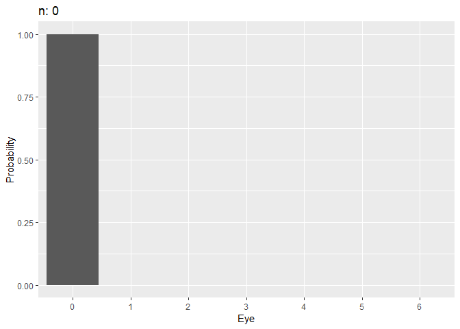

The following external R packages are used:

```{r loadings, warning = F, message = F}
library(dplyr)
library(gganimate)
gather <- tidyr::gather
```

<!--html_preserve-->
<div id="TOC" class="toc" style="padding:2rem 2rem 0 0;">
<ul style="list-style:none;">
<li><a href="#introduction">1. Introduction</a></li>
<li><a href="#the-largest-roll-until-now">2. The largest roll until now</a></li>
<li><a href="#session-info">Session info</a></li>
</ul>
</div>
&nbsp;
<!--/html_preserve-->


# 1. Introduction

This is to illustrate changes in marginal probabilities of the "largest value until the current die roll" Markov chain [^1] using `gganimate` package.

[^1]: Rosenthal, J. (2019, April 05). STA447/2006 (Stochastic Processes) Lecture Notes, Winter 2019. Retrieved May 23, 2019, from http://probability.ca/jeff/teaching/1819/sta447/notes.pdf


# 2. The largest roll until now

Say you're rolling a fair six-sided die. Let $X_0$ be $0$, and $X_n$ be the largest value that appears among all of the rolls up to time $n \geq 1 \text{ }$^[1](largest_roll.html#fn1)^. Clearly, the state space is $S = \{0, 1, 2, 3, 4, 5, 6 \}$ with initial probabilities $v_0 = P(X_0 = 0) = 1$, $v_s = 0$ for all $s \in S - \{ 0 \}$, and: $$p_{0j} = P(X_{n} = j \text{ | } X_{n - 1} = 0) = \frac{1}{6} \text{ } \forall j \in S - \{ 0\}$$ 

One fact you can see is that $X_n$ never decreases by definition, i.e. $X_{n - 1} \leq X_n$ for $n \geq 1$. And since we are tossing a fair die, the marginal probability of seeing either side is the same across all sides. So, for example, if $X_n$ is $4$, and $Y_{n + 1}$ is the value that appears at the $(n + 1)$^th^ roll, then since $P(Y_{n + 1} = i) = \frac{1}{6}$ for all $i \in S - \{ 0 \}$, we obtain:

\begin{align*}
p_{44} &= P(X_{n + 1} = 4 \text{ | } X_n = 4) = P(Y_{n + 1} \leq 4) = \frac{4}{6} \\
p_{45} &= P(X_{n + 1} = 5 \text{ | } X_n = 4) = P(Y_{n + 1} = 5) = \frac{1}{6} \\
&= p_{46}
\end{align*}

That is, if $1, 2, 3,$ or $4$ shows up at the $(n + 1)$^th^ roll, then the current maximum $X_{n + 1}$ is still $4$. Using the same argument for all $i, j \in S$, we get: $$p_{ij} = \begin{cases} \frac{j}{6} & i = j \\ \frac{1}{6} & i < j \\ 0 & i > j \end{cases}$$ 

Say $P_{7 \times 7}$ is the matrix of transition probabilities. Then it should be: $$P_{7 \times 7} = \big[p_{ij} \big]_{i = 0:6, j = 0:6}= \begin{bmatrix} 0 & \frac{1}{6} & \frac{1}{6} & \frac{1}{6} & \frac{1}{6} & \frac{1}{6} & \frac{1}{6} \\ 0 & \frac{1}{6} & \frac{1}{6} & \frac{1}{6} & \frac{1}{6} & \frac{1}{6} & \frac{1}{6} \\ 0 & 0 & \frac{2}{6} & \frac{1}{6} & \frac{1}{6} & \frac{1}{6} & \frac{1}{6} \\ 0 & 0 & 0 & \frac{3}{6} & \frac{1}{6} & \frac{1}{6} & \frac{1}{6} \\ 0 & 0 & 0 & 0 & \frac{4}{6} &  \frac{1}{6}& \frac{1}{6} \\ 0 & 0 & 0 & 0 & 0 & \frac{5}{6} & \frac{1}{6} \\ 0 & 0 & 0 & 0 & 0 & 0 & 1 \end{bmatrix}$$

My goal is to visualize the change in marginal probabilities $P(X_n = i)$, $i \in S$, as $n \to \infty$. I will define $P$-matrix, and set 50 as the maximum $n$:

```{r largest}
# Settings
max_n <- 50
v <- c(1, rep(0, 6)) # initial probabilities v_0, v_1, ..., v_6

# P matrix
P <- diag(0:6)
for (i in 1:7) {
    for (j in 1:7) {
        if (i < j) {
            P[i, j] <- 1
        }
    }
}
(P <- P / 6)
```

Say $P^k = P^{(k)}$ stores $p_{ij}^{(k)} = P(X_{n + k} = j \text{ | } X_n = i)$, i.e. the probability that $j$ will be the maximum after throwing a die exactly $k$ times given the current maximum of $i$. Also, say $\mu_k$ is the (row) vector of all $P(X_k = i)$'s, $i \in S$. Then given a vector of initial probabilities $v = \begin{bmatrix} v_0 & v_1 & \dots & v_6 \end{bmatrix}_{1 \times 7}$: $$\mu_k = v P^k$$

```{r marg_prob}
Pk <- function(P, k) {
    # P: a numeric matrix
    # k: a natural number
    
    lst_k <- vector('list', k)
    for (i in 1:k) {
        lst_k[[i]] <- P
    }
    Reduce('%*%', lst_k)
}
mu_k <- function(v, P, k) {t(v) %*% Pk(P, k)}
```

Each row of `mu_collection` consists of $n$ and $\mu_n$, in this order, $n = 0, 1, \dots, 50$:

```{r viz}
(mu_collection <- 
    t(sapply(1:max_n, function(k){mu_k(v, P, k)})) %>%
    rbind(v, .) %>%
    cbind(0:max_n, .) %>%
    'colnames<-'(c('n', 0:6)) %>%
    as_tibble())
```

It makes sense to see $P(X_n = 6) \to 1$ as $n$ increases. Now we should manipulate `mu_collection` so that it is ready for plotting a barplot of marginal probabilities at each $n$:

```{r viz2}
mu_tidy <- mu_collection %>% gather(key, value, -n)
```

And here's how marginal probabilities evolve as $n \to \infty$:

```{r animation, warning = F, message = F, fig.align = 'center', eval = F}
anim <- ggplot(mu_tidy, aes(x = key, y = value)) +
    geom_bar(stat = "identity") +
    labs(x = 'Eye', y = 'Probability', title = "n: {closest_state}") +
    transition_states(n) +
    enter_fade() +
    exit_fade()
animate(
    anim,
    fps = 30, duration = 30,
    start_pause = 5,
    end_pause = 5
)
```

```{r use_gif, fig.align = 'center', echo = F}

```

Indeed, $P(X_n = 6) \stackrel{p}{\to} 1$.


# Session info

R session info:

```{r session_info}
sessionInfo()
```


